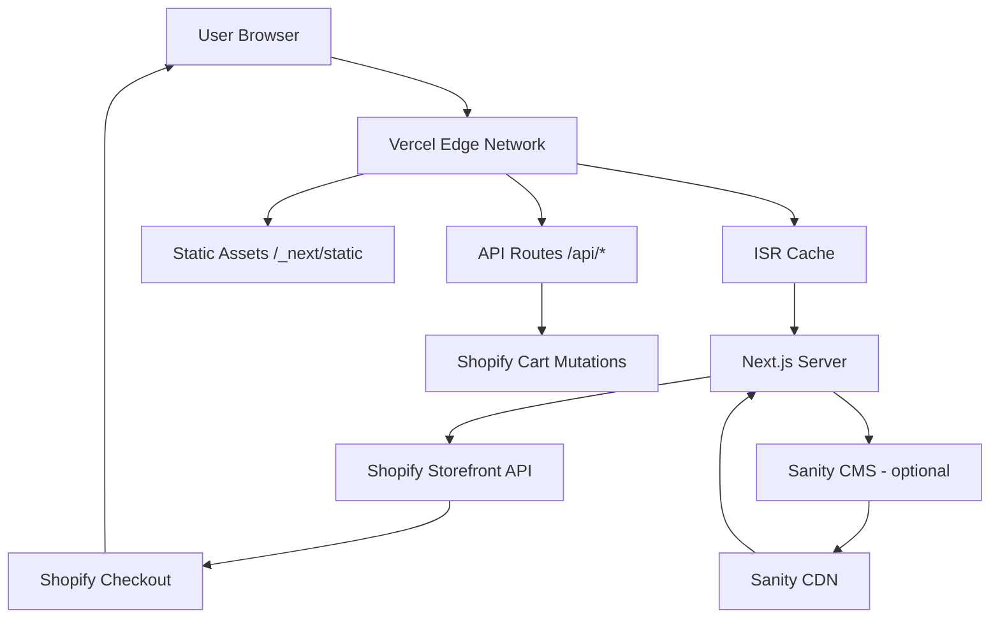

# TrustTheHood — Production Architecture

> **Стек:** Next.js 16.2.6 · React 19 · TypeScript strict · Tailwind CSS v4 · Framer Motion · Shopify Storefront API · Vercel

---

## 1. Hosting & Infrastructure

| Компонент | Решение |
|-----------|---------|
| Хостинг | **Vercel** (Pro или Enterprise) |
| Домен | `trustthehood.com` (кастомный, DNS у Vercel) |
| CDN | Vercel Edge Network — статика, ISR, API Routes |
| CI/CD | GitHub → Vercel auto-deploy (branch `main`) |

**Branch-based deployments:**
- `main` → Production (`trustthehood.com`)
- PRs → Preview Deployments (ephemeral URLs)

---

## 2. Frontend Architecture

```
trustthehood-next/
├── src/
│   ├── app/                        # Next.js App Router
│   │   ├── page.tsx                # Home — ISR (revalidate: 60)
│   │   ├── shop/page.tsx           # Shop listing — ISR
│   │   ├── shop/[handle]/page.tsx  # Product detail — ISR
│   │   ├── collections/page.tsx    # Collections — ISR
│   │   ├── collections/[handle]/   # Collection detail — ISR
│   │   ├── lookbook/page.tsx       # Lookbook — SSG
│   │   ├── info/page.tsx           # Info — SSG
│   │   ├── cart/page.tsx           # Cart — CSR (client-only)
│   │   ├── api/shopify/route.ts    # Shopify proxy — Edge
│   │   ├── error.tsx               # 500 error page
│   │   ├── not-found.tsx           # 404 page
│   │   └── loading.tsx             # Global loading state
│   ├── components/
│   │   ├── ui/                     # Container, Button, Grid, Heading, Text, Image
│   │   ├── layout/                 # Header, Footer, AnnouncementBar, MobileMenu, Layout
│   │   ├── hero/                   # Hero, HeroImage, HeroText
│   │   ├── products/              # ProductCard, ProductGrid, ProductGallery, ProductSizes, AddToCart, ProductInfo
│   │   ├── editorial/             # EditorialBanner, LookbookGrid, MarqueeText
│   │   ├── collections/           # CollectionGrid, CollectionHero
│   │   ├── cart/                  # CartDrawer, CartItem, CartSummary
│   │   └── animations/           # FadeIn, Reveal, SmoothScroll
│   ├── lib/
│   │   ├── shopify/               # Shopify Storefront API (Server-only)
│   │   │   ├── client.ts          # GraphQL client (endpoint, token, fetch)
│   │   │   ├── queries.ts         # All GraphQL queries
│   │   │   ├── mutations.ts       # Cart mutations
│   │   │   ├── products.ts        # Product fetchers
│   │   │   ├── collections.ts     # Collection fetchers
│   │   │   └── cart.ts            # Cart operations
│   │   ├── hooks/                 # Client-side hooks
│   │   │   ├── useCart.ts         # Cart state + localStorage persistence
│   │   │   ├── useScroll.ts       # Scroll position
│   │   │   └── useWindowSize.ts   # Window dimensions (SSR-safe)
│   │   ├── utils/                 # Utilities
│   │   │   ├── constants.ts       # Business constants
│   │   │   ├── clsx.ts            # Classnames helper
│   │   │   └── formatPrice.ts     # Price formatting (EUR)
│   │   └── cms/                   # Sanity CMS (fallback only)
│   ├── styles/
│   │   ├── typography.css         # Typography scale + utility classes
│   │   ├── animations.css         # Keyframe animations
│   │   └── layout.css             # Layout utilities
│   ├── types/                     # TypeScript types
│   │   ├── product.ts
│   │   ├── cart.ts
│   │   └── collection.ts
│   ├── config/
│   │   ├── site.ts               # Site metadata config
│   │   └── navigation.ts         # Navigation links config
│   └── app/globals.css           # Tailwind v4 + CSS custom properties
├── public/                        # Static assets
├── next.config.ts                 # Next.js config (defaults)
├── tsconfig.json                  # TypeScript strict
├── tailwind.config.ts             # Tailwind config
└── package.json                   # Dependencies
```

### Rendering Strategies

| Page | Strategy | Cache |
|------|----------|-------|
| `/` (Home) | ISR (revalidate: 60s) | CDN + stale-while-revalidate |
| `/shop` | ISR | CDN |
| `/shop/[handle]` | ISR | CDN |
| `/collections` | ISR | CDN |
| `/collections/[handle]` | ISR | CDN |
| `/lookbook` | SSG | CDN forever |
| `/info` | SSG | CDN forever |
| `/cart` | CSR | No cache (dynamic) |

**ISR invalidation:** При обновлении товара/коллекции в Shopify → webhook → Vercel `revalidateTag()` / `revalidatePath()`.

---

## 3. Data Flow

```
┌─────────────────────────────────────────────────────────┐
│                    Shopify Admin                          │
│  (Products, Collections, Inventory, Orders)               │
└────────────────────────┬────────────────────────────────┘
                         │
                         ▼
┌─────────────────────────────────────────────────────────┐
│              Shopify Storefront API (GraphQL)             │
│  Endpoint: https://{store}.myshopify.com/api/2024-01    │
│  Auth: Storefront Access Token (public)                   │
└────────────────────────┬────────────────────────────────┘
                         │
          ┌──────────────┴──────────────┐
          │                              │
          ▼                              ▼
┌──────────────────┐          ┌──────────────────┐
│  Next.js Server   │          │   Client-side     │
│  (RSC / Server    │          │   (Cart hooks)    │
│   Components)     │          │                   │
│                   │          │   useCart() →     │
│  - products.ts    │          │   Shopify Cart    │
│  - collections.ts │          │   API (mutations) │
│  - cart.ts        │          │                   │
└────────┬─────────┘          └────────┬─────────┘
         │                              │
         ▼                              ▼
┌─────────────────────────────────────────────────────────┐
│                    Vercel Edge Network                    │
│  - ISR Cache                                              │
│  - RSC Payload (streaming)                                │
│  - Static Assets (/_next/static)                          │
└─────────────────────────────────────────────────────────┘
         │
         ▼
┌─────────────────────────────────────────────────────────┐
│              Shopify Checkout (hosted)                    │
│  https://{store}.myshopify.com/cart/{id}                 │
│  Или: Embedded Checkout via Storefront API                │
└─────────────────────────────────────────────────────────┘
```

### Key Design Decisions

1. **Server Components for data fetching** — Все запросы к Shopify выполняются на сервере. Клиент получает готовый HTML + RSC payload.
2. **Cart on client** — Корзина использует `useCart()` хук с localStorage persistence + Shopify Cart API для синхронизации.
3. **No SDK** — Используется кастомный GraphQL клиент вместо `shopify-buy` SDK. Легче, меньше багов, полный контроль над запросами.
4. **Checkout redirect** — После добавления в корзину — редирект на Shopify Checkout (hosted). Это стандартный подход для брендов без кастомного чекаута.

---

## 4. Shopify Integration

### GraphQL Client (`lib/shopify/client.ts`)

```typescript
const endpoint = `https://${process.env.SHOPIFY_STORE_DOMAIN}/api/2024-01/graphql.json`;
const token = process.env.SHOPIFY_STOREFRONT_ACCESS_TOKEN;

// Кастомный fetch для GraphQL запросов
// Server-only (RSC, API Routes)
// Обработка ошибок: throw on non-200, парсинг GraphQL errors
```

### Queries (`lib/shopify/queries.ts`)

| Query | Usage |
|-------|-------|
| `HOME_PAGE_QUERY` | Hero products, featured collections |
| `PRODUCTS_QUERY` | Shop listing with pagination |
| `PRODUCT_QUERY` | Single product detail |
| `COLLECTIONS_QUERY` | All collections with totalCount |
| `COLLECTION_QUERY` | Single collection with products |
| `CART_CREATE_MUTATION` | Create new cart |
| `CART_ADD_LINES_MUTATION` | Add items |
| `CART_REMOVE_LINES_MUTATION` | Remove items |
| `CART_UPDATE_LINES_MUTATION` | Update quantities |

### Environment Variables

```env
SHOPIFY_STORE_DOMAIN=trustthehood.myshopify.com
SHOPIFY_STOREFRONT_ACCESS_TOKEN=xxxxxxxxxxxxxxxx
NEXT_PUBLIC_SITE_URL=https://trustthehood.com
# Optional:
SANITY_PROJECT_ID=xxxxxx
SANITY_DATASET=production
```

---

## 5. CMS Strategy (Sanity — Optional)

**Текущий статус:** Sanity **не установлен** в проекте. В `lib/cms/index.ts` есть fallback-данные для editorial-контента (lookbook, info страницы).

### Когда подключать Sanity

- Когда editorial-контента станет много (10+ статьей/записей)
- Когда маркетинг/контент-менеджеры захотят редактировать контент без кода
- Когда потребуется: Announcement bar, SEO-тексты, баннеры

### Рекомендуемая схема подключения

```typescript
// lib/cms/index.ts
// 1. @sanity/client — GROQ запросы
// 2. @portabletext/react — Portable Text rendering
// 3. next-sanity-image — оптимизированные изображения

// Revalidation: Sanity webhook → Vercel revalidateTag()
```

### Схема Sanity (рекомендуемая)

```typescript
// schemas/editorial.ts
export default {
  name: 'editorial',
  title: 'Editorial',
  type: 'document',
  fields: [
    { name: 'title', type: 'string' },
    { name: 'slug', type: 'slug' },
    { name: 'heroImage', type: 'image' },
    { name: 'content', type: 'blockContent' }, // Portable Text
    { name: 'products', type: 'array', of: [{ type: 'reference', to: [{ type: 'product' }] }] },
    { name: 'seo', type: 'seo' },
  ],
};
```

---

## 6. Styling Architecture

### Tailwind CSS v4

```css
/* globals.css */
@import "tailwindcss";

@theme inline {
  --color-background: #ffffff;
  --color-foreground: #111111;
  --color-accent: #777777;
  --color-border: #e0e0e0;
  --color-muted: #f5f5f5;
  --font-sans: 'Space Grotesk', 'Helvetica Neue', Arial, sans-serif;
}
```

### Typography Scale

| Token | Value | Usage |
|-------|-------|-------|
| `--text-xs` | 0.75rem | Labels, meta |
| `--text-sm` | 0.875rem | Body small |
| `--text-base` | 1rem | Body |
| `--text-lg` | 1.125rem | Body large |
| `--text-xl` | 1.25rem | Subtitles |
| `--text-2xl` | 1.5rem | Section titles |
| `--text-3xl` | 2rem | Headings |
| `--text-display` | `clamp(3rem, 8vw, 6rem)` | Hero text |

### Spacing (proposed)

```typescript
// lib/utils/constants.ts (add)
export const spacing = {
  section: '160px',
  grid: '24px',
};
```

---

## 7. Animations

| Library | Bundle Size | Usage | Status |
|---------|-------------|-------|--------|
| Framer Motion | ~30KB gzip | Page transitions, hover effects, scroll reveals, marquee | ✅ Установлен |
| Lenis | ~5KB gzip | Smooth scroll (optional, editorial pages only) | ❌ Не установлен |
| GSAP | ~40KB gzip | Complex timeline animations | ❌ Не установлен |

**Рекомендация:** Framer Motion достаточно для текущих задач. Lenis можно добавить для editorial-страниц. GSAP не рекомендуется из-за веса — только если потребуются сложные timeline-анимации.

### Анимационные паттерны

```tsx
// components/animations/FadeIn.tsx
<FadeIn direction="up" delay={0.2}>
  <YourComponent />
</FadeIn>

// components/animations/Reveal.tsx — scroll-triggered reveal
<Reveal>
  <YourComponent />
</Reveal>

// components/animations/SmoothScroll.tsx — Lenis wrapper (optional)
```

---

## 8. Performance Budget

| Метрика | Цель |
|---------|------|
| LCP | < 1.5s |
| TBT | < 100ms |
| CLS | < 0.1 |
| FID/INP | < 100ms |
| First Load JS | < 200KB (gzip) |
| Lighthouse | > 95 (Mobile) |

### Оптимизации

- **Images:** `next/image` → WebP/AVIF, lazy loading, responsive breakpoints
- **Fonts:** `next/font` → Space Grotesk self-hosted, `display: swap`
- **Bundle:** Framer Motion code-split per component (dynamic import for heavy animations)
- **ISR:** Страницы продуктов и коллекций кешируются на Edge, ревалидируются при изменениях
- **CSS:** Tailwind JIT — только используемые классы в production

---

## 9. SEO & Metadata

```typescript
// app/layout.tsx — глобальный metadata
export const metadata: Metadata = {
  title: 'TrustTheHood — Streetwear',
  description: 'Streetwear for the lost ones. Raw cuts, heavy cotton, no logos.',
};

// generateMetadata() для динамических страниц (продукты, коллекции)

// Структурированные данные:
// - Product (JSON-LD) — страница товара
// - Collection (JSON-LD) — страница коллекции
// - Organization (JSON-LD) — глобально
```

### Sitemap

```typescript
// app/sitemap.ts
// Dynamic: все продукты + коллекции из Shopify
// Static: /lookbook, /info, /collections

Static routes: /, /shop, /collections, /lookbook, /info, /cart
Dynamic routes: /shop/{handle} (N products), /collections/{handle} (N collections)
```

---

## 10. Monitoring & Analytics

| Сервис | Назначение | Статус |
|--------|------------|--------|
| Vercel Analytics | Traffic, Web Vitals | ✅ Vercel built-in |
| Vercel Speed Insights | Core Web Vitals | ✅ Vercel built-in |
| Shopify Analytics | Sales, conversion | ✅ Shopify built-in |
| GA4 / Plausible / Umami | Custom events, pageviews | ❌ Не настроено |

**Рекомендация:** Plausible или Umami — легковесные, без cookie-баннеров (GDPR-friendly).

---

## 11. CI/CD Pipeline

```
Git push → GitHub
    │
    ▼
GitHub Actions (optional, можно Vercel auto)
    ├── biome lint (или eslint)
    ├── tsc --noEmit (type check)
    ├── npm run build (build check)
    └── npm test (if any)
    │
    ▼
Vercel
    ├── Preview (PR) — отдельный URL
    │   ├── npm install
    │   ├── npm run build
    │   └── Deploy to preview domain
    │
    └── Production (main)
        ├── npm install
        ├── npm run build
        └── Deploy to trustthehood.com
```

---

## 12. Scaling Roadmap

| Scale | Действие |
|-------|----------|
| 1K–5K products | ISR + cursor-based pagination — без изменений |
| 10K+ products | Добавить Algolia / Searchify для поиска и фильтрации |
| 100K req/month | Vercel Pro — без изменений |
| 1M+ req/month | Vercel Enterprise или Cloudflare Workers для edge-кеша |
| Multi-language | next-intl + Shopify Markets |
| Multi-currency | Shopify Markets → auto geo-detection |
| Editorial growth | Подключить Sanity CMS |
| Custom checkout | Заменить Shopify hosted checkout на кастомный (via Storefront API) |

---

## 13. Security

- **Shopify token:** Только server-side (RSC, API Routes). Никогда не передаётся на клиент.
- **API Routes:** Rate limiting через Vercel WAF или middleware.
- **CORS:** Vercel автоматически настраивает CORS. Для API Routes можно добавить middleware.
- **XSS:** React защищает от XSS. `dangerouslySetInnerHTML` не используется.
- **Dependencies:** Dependabot для автоматических апдейтов.

---

## 14. Deployment Checklist (before production)

- [ ] Добавить `SHOPIFY_STORE_DOMAIN` и `SHOPIFY_STOREFRONT_ACCESS_TOKEN` в Vercel Environment Variables
- [ ] Подключить кастомный домен в Vercel Dashboard
- [ ] Настроить Shopify webhooks → Vercel ISR revalidation:
  - `products/create`, `products/update`, `products/delete`
  - `collections/create`, `collections/update`, `collections/delete`
- [ ] Настроить `next.config.ts`:
  - `images.remotePatterns` для Shopify CDN (`cdn.shopify.com`)
  - `headers` для security (CSP, HSTS)
- [ ] Настроить `robots.txt` и `sitemap.xml`
- [ ] Проверить метаданные и Open Graph
- [ ] Настроить revalidation API route:
  ```typescript
  // app/api/revalidate/route.ts
  export async function POST(request: Request) {
    const secret = request.headers.get('x-revalidate-secret');
    if (secret !== process.env.REVALIDATION_SECRET) return Response.json({ message: 'Unauthorized' }, { status: 401 });
    await revalidatePath('/shop');
    await revalidatePath('/collections');
    return Response.json({ revalidated: true });
  }
  ```
- [ ] Проверить `npm run build` — без ошибок
- [ ] Проверить Lighthouse audit
- [ ] Настроить 301 редиректы (если есть старые URL)

---

## 15. Diagram (Mermaid)



---

## 16. Tech Stack Summary

| Category | Technology | Version |
|----------|-----------|---------|
| Framework | Next.js | 16.2.6 |
| UI Library | React | 19.2.4 |
| Language | TypeScript | 5.x (strict) |
| Styling | Tailwind CSS | v4 |
| Animations | Framer Motion | 12.38.0 |
| Smooth Scroll | Lenis | not installed (optional) |
| GSAP | GSAP | not installed (optional) |
| E-commerce | Shopify Storefront API | 2024-01 |
| CMS | Sanity | not installed (optional) |
| Hosting | Vercel | Pro/Enterprise |
| Font | Space Grotesk | Google Fonts (self-hosted) |
| Icons | Inline SVGs | custom |

---

*Document version: 1.0 — May 2026*
*Stack: Next.js 16 · React 19 · Tailwind v4 · Shopify · Vercel*